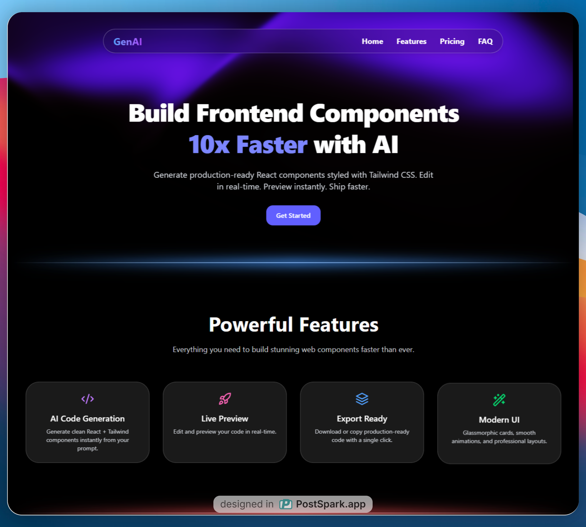

# 🚀 GenAi – AI-Powered Component Generator  

GenAi is a **SaaS-style platform** that helps developers **generate, preview, and customize UI components** instantly with AI-powered suggestions.  
Built with **React (Vite), TailwindCSS, Node.js, and Express**, it provides a smooth developer experience and a modern, responsive UI.  

---

## 📸 Preview  
 

---

## ✨ Features  
- 🤖 **AI-Powered Component Generation** – Get ready-to-use React components in seconds  
- ⚡ **Live Preview** – Instantly preview and test components before using them  
- 🎨 **Customizable UI** – TailwindCSS-powered styling with modern design principles  
- 📝 **Monaco Editor Integration** – Edit and refine components directly in the browser  
- 🌙 **SaaS-Ready UI** – Dashboard, profile, pricing, settings, and demo preview pages  
- 🔐 **Authentication Ready** – Login & Signup flows included  

---

## 🛠️ Tech Stack  

### Frontend  
- **React (Vite)** – Fast development experience  
- **TailwindCSS** – Modern and responsive design  
- **Framer Motion** – Smooth animations  
- **React Helmet Async** – SEO optimization  
- **Monaco Editor** – In-browser code editing  

### Backend  
- **Node.js** – Server runtime  
- **Express.js** – REST API layer  
- **Multer** – File uploads (profile image, etc.)  
- **MongoDB**  – For data storage 

### Deployment  
- **Vercel** – Frontend & Backend hosting  
 

---

## 🔗 Demo  
👉 [Live Demo](https://genai-dev.vercel.app/)  

---

## 🚀 Getting Started  

### 1️⃣ Clone the repository  
```bash
git clone https://github.com/yourusername/component-gen-ai-saas.git
cd component-gen-ai-saas
```
### 2️⃣ Install dependencies
```bash
npm install
```
### 3️⃣ Start development server
```bach
npm run dev
```
### 📄 License
# MIT License © 2025 Muhammad Rabbi

